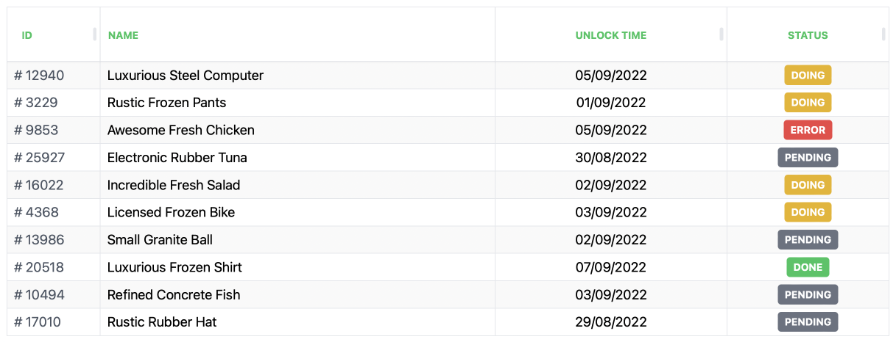
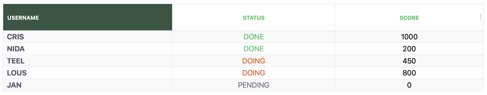
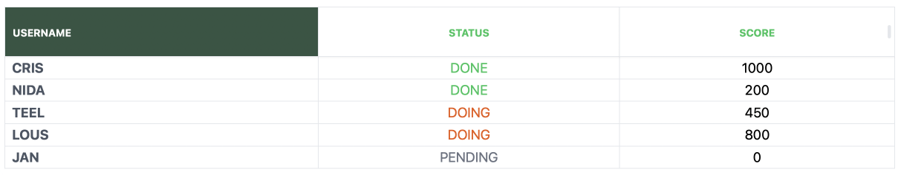

# SIMPLE TAILWIND TABLE FOR REACT

> It's easy to make an table with tailwind styles



## Feature planing

- [ ] Support header drag and drop
- [ ] Support sticky more columns
- [ ] Support global header's row and body's row theme

## Usage

#### 1. Install

```bash
    npm install react-simple-tailwind-table
```

OR

```bash
    yarn install react-simple-tailwind-table
```

#### 2.Import to your source

```ts
import { useTableConfiguration, TailwindTable } from '@hooks/useTableConfiguration';
```

#### 3.Declare your configuration with hook

```ts
const temp = [
  { name: 'CRIS', status: 'DONE', score: 1000 },
  { name: 'NIDA', status: 'DONE', score: 200 },
  { name: 'TEEL', status: 'DOING', score: 450 },
  { name: 'LOUS', status: 'DOING', score: 800 },
  { name: 'JAN', status: 'PENDING', score: 0 },
];

const { tableData, tableColumns } = useTableConfiguration(temp, [
  {
    label: 'Username',
    accessor: 'name',
    body: { className: 'font-bold text-gray-600' },
    header: { background: '#345543', className: 'text-white' },
    align: 'left',
  },
  {
    label: 'Status',
    accessor: 'status',
    body: { className: 'px-2' },
    renderData: (data) => {
      const color = {
        DONE: 'text-green-500',
        DOING: 'text-orange-600',
        PENDING: 'text-gray-500',
      };
      return <span className={color[data.status]}>{data.status}</span>;
    },
  },
  { label: 'Score', accessor: 'score', sort: (a, b) => a.score - b.score },
]);
```

#### 4. Render your table

```ts
<TailwindTable data={tableData} columns={tableColumns} />
```



##### Difference (OPTIONAL)

```ts
/**
 * Different each rows
 * difference:
 *  - enable: boolean, default is true
 *  - offset: different offset, 0.0 <> 1.0, higher -> darker
 */
<TailwindTable data={tableData} columns={tableColumns} differnce={{ enable: false }} />
```



##### Columns configuration

```ts
interface ITableColumn {
  /**
   * Label in header
   */
  label: string;

  /**
   * Key of value in data
   */
  accessor: string;

  /**
   * Width of column
   */
  width?: CSSProperties['width'];

  /**
   * Content align in column
   */
  align?: CSSProperties['textAlign'];

  /**
   * Custom render content
   */
  renderData?: (data: T, tableState?: ITableState) => ReactNode;

  /**
   * Custom render header
   */
  renderHeader?: (tableState?: ITableState) => ReactNode;

  /**
   * Sort method of this column, return score for normal array sort method
   * fn: (a: T, b: T) => number (score)
   */
  sort?: TTableSortFn<T>;

  /**
   * Extra config for body
   */
  body?: {
    className?: string;
    background?: CSSProperties['background'];
  };

  /**
   * Extra config for header
   */
  header?: {
    className?: string;
    background?: CSSProperties['background'];
    /**
     * Animation btn when hover or active (For sortable column)
     * @default: `hover:scale-105 active:scale-95`
     */
    buttonClass?: string;
  };

  /**
   * Enable by default, visible when `sortFN` is available
   */
  filter?: {
    show?: boolean;
    dotColor?: string;
    /**
     * Custom render of filtered dot
     */
    render?: (tableState: ITableState) => ReactNode;
  };
}
```

### Technologies

- Typescript
- SCSS
- React
- Jest
- Rollup
- Storybook

### Maintainer

@saintno
